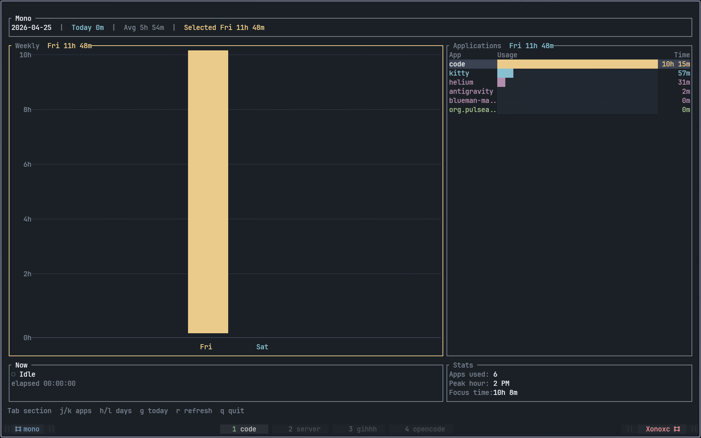

# Mono - Screen Time Tracker (Linux Only)

<p align="center">
  
</p>

A privacy-first screen time tracking application for Linux with a polished terminal-based user interface (TUI). Mono runs silently in the background to track your application usage while providing a beautiful, htop-inspired dashboard for visualization.

---

## Features

- **Privacy-First**: All data stored locally in SQLite, never leaves your machine
- **TUI Dashboard**: Beautiful terminal interface inspired by htop, btop, and lazygit
- **Background Tracking**: Runs as a daemon on system startup
- **Real-Time Updates**: Live tracking of active applications
- **Weekly Overview**: Visual bar chart of daily screen time
- **Application Stats**: Detailed breakdown of time spent per application
- **Window Manager Support**: Integrated with Hyprland, Sway, KDE, and other Wayland compositors

---

## Requirements

- **Linux only** (tested on Arch Linux with Hyprland)
- **Rust** 1.70 or later
- **Cargo** (included with Rust)
- **SQLite** (bundled with the application)

### Supported Desktop Environments

| Environment | Status | Notes |
|-------------|--------|-------|
| **Hyprland** | Full support | Automatic detection |
| **Sway** | Full support | Automatic detection |
| **KDE (Wayland)** | Full support | Uses KWin D-Bus interface |
| **Other Wayland** | Fallback | Basic tracking via X11 tools |
| **X11** | Disabled | Use Wayland instead |

---

## Installation

```bash
git clone https://github.com/xonoxc/mono.git
cd mono
./install.sh
```

The install script builds the release binary, installs it to `~/.local/bin/mono-tracker`, and sets up autostart via systemd (with XDG autostart as fallback).

### Manual Installation

```bash
cargo build --release
./install.sh
mono # launch dashboard
```

### Uninstall

```bash
./uninstall.sh
```

---

## Binaries

| Binary | Purpose |
|--------|---------|
| `mono` | TUI Dashboard |
| `mono-tracker` | Background tracking daemon |
| `mono-cli` | CLI management tool |

---

## Usage

### TUI Controls

| Key | Action |
|-----|--------|
| `j` / `Down` | Scroll down |
| `k` / `Up` | Scroll up |
| `h` / `Left` | Previous day |
| `l` / `Right` | Next day |
| `g` | Go to today |
| `r` | Refresh data |
| `Tab` | Switch between sections |
| `q` | Quit |

### First Run

On first launch, Mono displays a consent prompt:
- **Enable Tracking**: Starts the daemon and enables autostart
- **Skip for Now**: Opens dashboard without tracking

---

## CLI Commands

```bash
mono-cli status    # Check tracking status
mono-cli setup     # Enable tracking and autostart
mono-cli unsetup   # Disable tracking and remove autostart
```

### Daemon Control

```bash
mono-tracker        # Start daemon manually
pkill mono-tracker  # Stop daemon
pgrep mono-tracker # Check if running
```

---

## Architecture

```
src/
├── main.rs                # Daemon entry point
├── lib.rs                 # Core library
├── session_manager.rs     # Session management & tracking
├── storage.rs            # SQLite database
├── autostart.rs         # Autostart registration
├── window_managers/     # Window manager integrations
│   ├── mod.rs          # WindowManager trait & detection
│   ├── hyprland.rs     # Hyprland (hyprctl)
│   ├── sway.rs         # Sway (swaymsg)
│   ├── kde.rs          # KDE (KWin D-Bus)
│   ├── generic_wayland.rs # Fallback (X11 tools)
│   └── x11.rs          # X11 (disabled)
├── ipc_server.rs        # IPC server
└── tui/
    ├── main.rs         # TUI dashboard
    ├── db.rs          # Database queries
    └── consent.rs     # Consent handling
```

### Data Storage

- **Database**: `~/.local/share/mono/mono.db`
- **Config**: `~/.config/mono/`
- **Consent**: `~/.config/mono/consent`

---

## Development

```bash
cargo build           # Debug build
cargo build --release # Release build
cargo test            # Run tests
cargo run --bin mono  # Run TUI
```

### Tests

```bash
cargo test           # All tests
```

---

## Key Dependencies

- **ratatui**: Terminal UI framework
- **rusqlite**: SQLite bindings
- **sysinfo**: System information
- **chrono**: Date/time handling

---

## Troubleshooting

### Daemon Not Running

```bash
mono-cli setup
```

### View Database

```bash
sqlite3 ~/.local/share/mono/mono.db
sqlite3 ~/.local/share/mono/mono.db ".schema"
```

### Window Manager Not Detected

The daemon falls back to basic tracking without window titles. Ensure you're running a supported Wayland compositor.
